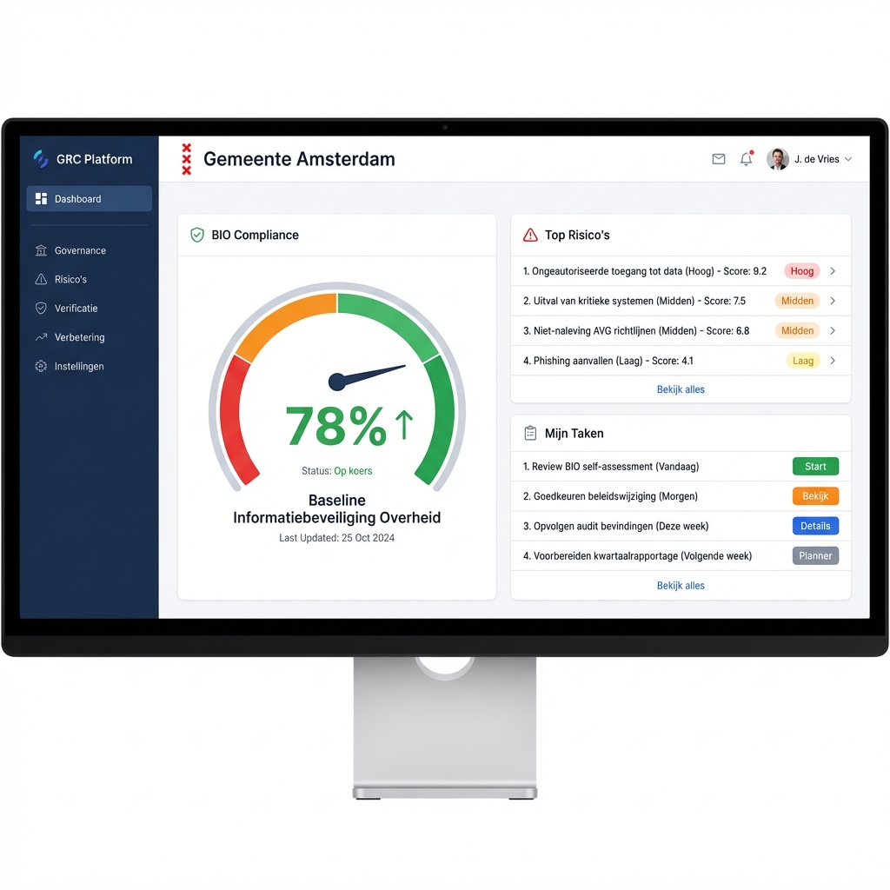
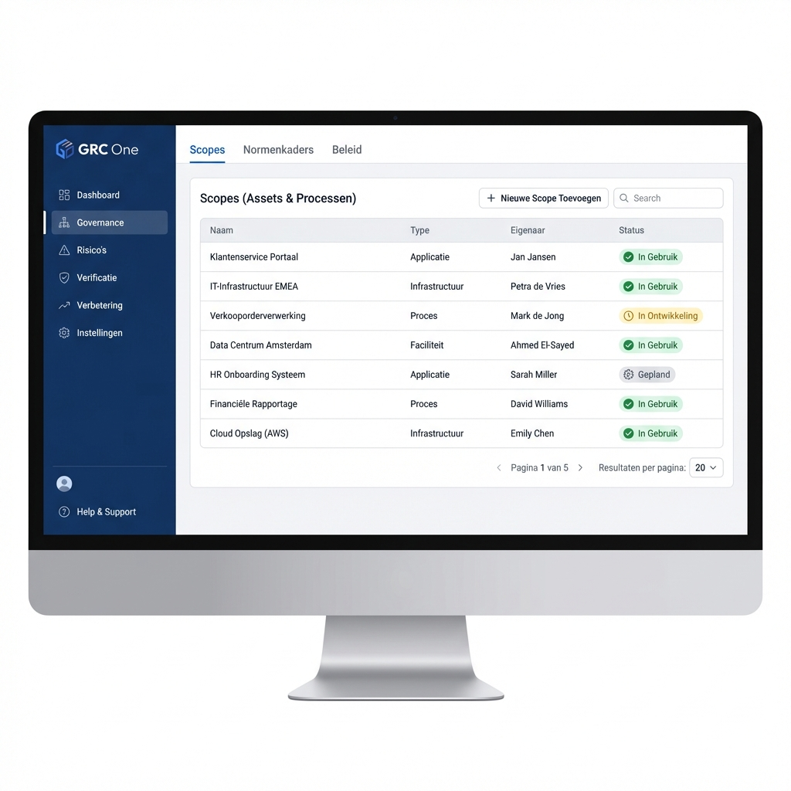
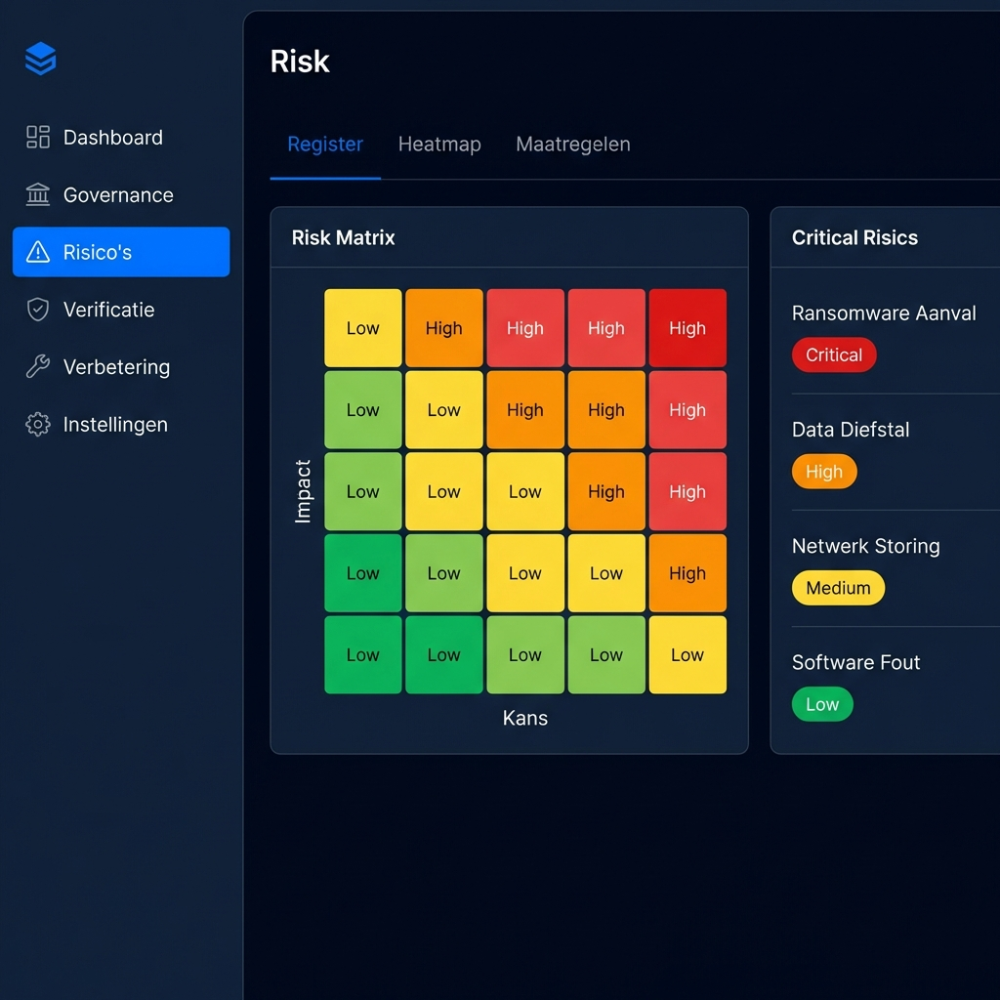
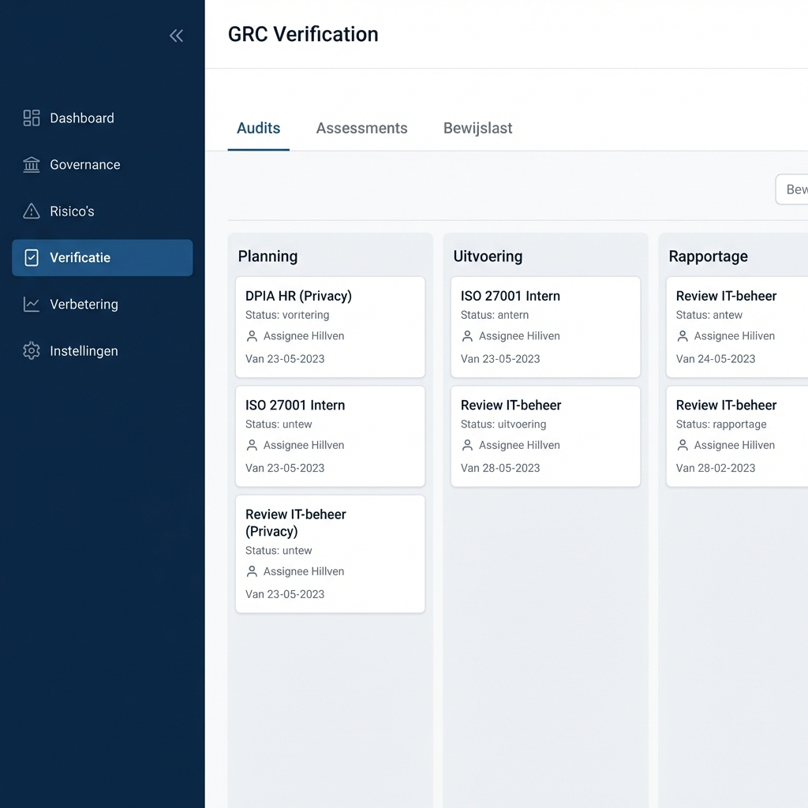
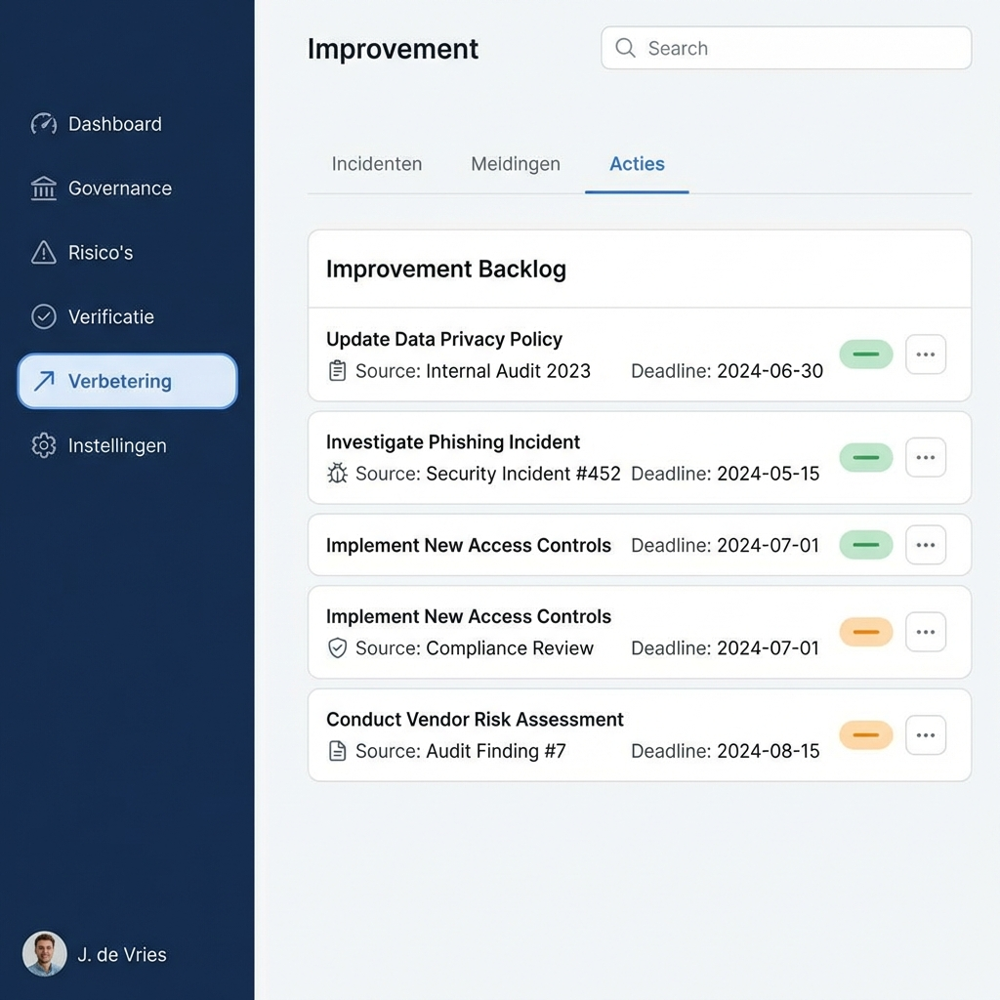

# IMS Systeem Ontwerp Schetsen

Hieronder vind je de visuele schetsen van het huidige systeem, gebaseerd op het datamodel en de architectuurprincipes ("The Model leads"). De interface is ontworpen met een focus op duidelijkheid, consistentie en een moderne "Enterprise GRC" uitstraling.

## Systeem Structuur (Sitemap)
De navigatiestructuur volgt de PDCA-cyclus:

1.  **Dashboard** (Overzicht)
2.  **Governance** (The Model)
    *   Scopes (Assets & Processen)
    *   Normenkaders
    *   Beleid
3.  **Risico's** (Plan & Do)
    *   Risico Register
    *   Heatmap
    *   Maatregelen
4.  **Verificatie** (Check)
    *   Audits & Assessments
    *   Bewijslast
5.  **Verbetering** (Act)
    *   Incidenten
    *   Meldingen
    *   Verbeteracties (Backlog)
6.  **Instellingen**

---

## 1. Hoofdpagina (Dashboard)
Het centrale startpunt voor de CISO en Privacy Officer. Geeft direct inzicht in compliance status (BIO), top risico's en openstaande taken.

## 2. Governance
Beheer van de reikwijdte (Scopes) en normenkaders. Hier worden assets, processen en afdelingen vastgelegd en gekoppeld aan eigenaren.

## 3. Risico Management
De kern van de "Plan" fase. Een heatmap visualiseert de risico's (Impact vs Kans) en biedt een gefilterde lijst van de meest kritieke items zoals Ransomware of Datalekken.

## 4. Verificatie
De "Check" fase. Monitoring van lopende audits, assessments (zoals DPIA's) en het verzamelen van bewijslast.

## 5. Verbetering
De "Act" fase. Een gecombineerde backlog van incidenten, bevindingen uit audits en proactieve verbetertaken.

